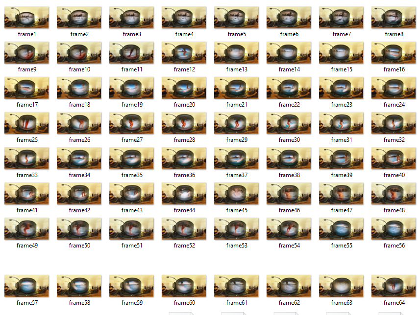

# RICOH THETA SC2 Live Preview Tester

For V/Z1, see my other project using dio as the HTTP library.

## Save Frames to Disk for Inspection



## Use Within Flutter


## Usage

1. create a stream (for Flutter, it is easier to use StreamController
2. pass stream to library
3. specify number of frames to capture
4. listen to stream and either write frames to disk or display to screen

## Example

Code example with Flutter

```dart
class _MyHomePageState extends State<MyHomePage> {
  @override
  Widget build(BuildContext context) {
    StreamController controller = StreamController();
    sc2GetLivePreview(controller, frames: 300);
    return Scaffold(
// your ui
//
Expanded(
    flex: 8,
    child: StreamBuilder(
        stream: controller.stream,
        builder: (BuildContext context, AsyncSnapshot snapshot) {
        if (snapshot.hasData) {
            var imageData = Uint8List.fromList(snapshot.data);
            return Image.memory(
            imageData,
            gaplessPlayback: true,
            );
        } else {
            return Container();
        }
        }),
),
```